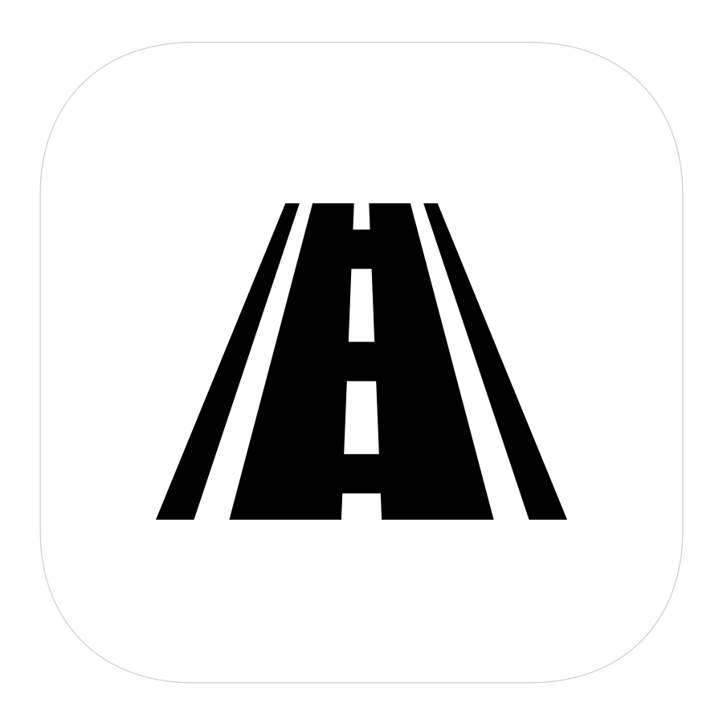
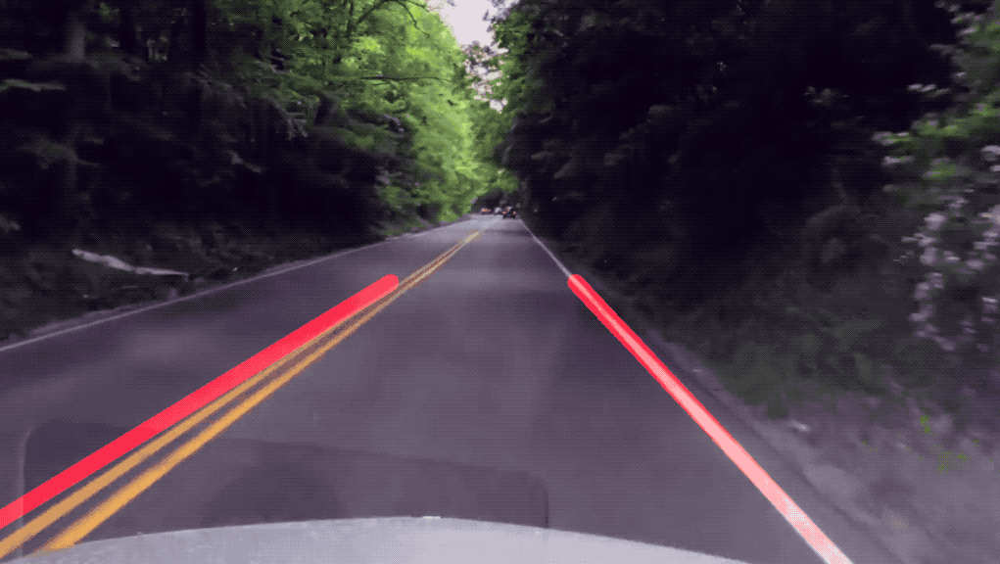
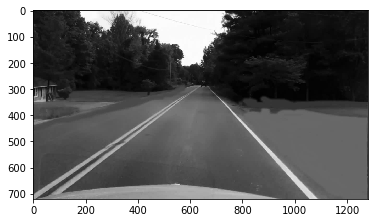
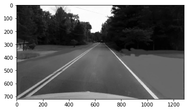
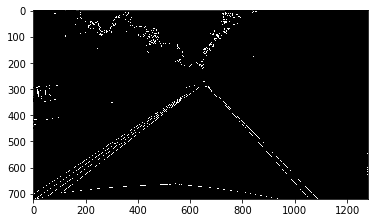
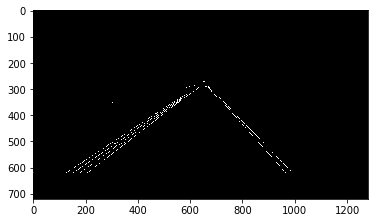
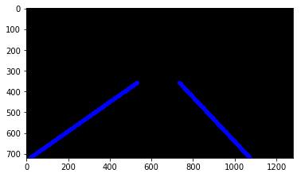
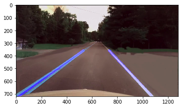

<h3 align="center">
  
</h3>

# Street Lanes Finder

Computer Vision approach to the street lanes detection problem.

## How does it work?

1. Grayscale
 

2. Blur
 

3. Canny
 

4. Region Of Interest
 

4. Hough Lines
 

5. Combined Images
 

